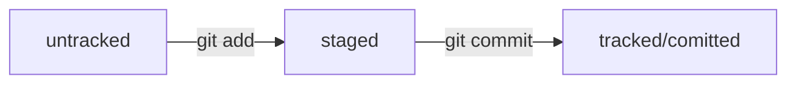

# Шпаргалка-гайд: GitHub, GitBash, MarkDown

____

Небольшая шпаргалка для себя в будущем

____

____

## Навигация в GitBash

____

pwd (print working directory) - Узнать в какой директории находимся

cd ***имя директории*** (change directory) - Перейти в другую директорию

. (точка) - Ссылка на текущую папку

.. (две точки) - Ссылка на предыдущую папку

ls (list) - Показать список файлов и папок в текущей директории

ls -a (all) - Показать ВСЕ файлы и папки, включая скрытые

ls -l (large наверно) - Показывает более подробную информацию о файлах

____

**Флаги можно миксовать друг с другом, например -la**

____

rm ***Имя файла или директории*** (remove) - Удаляет файл или пустую папку

rm -r (recursieve) - Удаляет папку и ВСЕ что внутри нее

rm -f (force) - Удаляет папку без подтверждения на удаление

____

touch ***Имя файла*** (Прикоснуться ~тыкнуть~) - Создать ФАЙЛ

mkdir ***Имя директории*** (make directory) - Создать ДИРЕКТОРИЮ

____

cat ***Имя файла или директории*** (concatenate ~кот?~) - Выводит содержимое файла/файлов, может вывести последовательно несколько файлов

echo ***Имя файла*** (эхо походу) - Выводит ТЕКСТ в терминал или файл

echo "*Текст*" >> ***Имя файла*** - Запишет строку в конце файла (>> - перенаправление потока ввода)

echo "*Текст*" > ***Имя файла*** - Запишет строку в файл, удалив все что было

____

cp ***Имя файла/директории*** (copy) - Копирует файл или директорию

mv ***Имя файла/директории*** (move) - Перемешает файл или директорию

clip < ***имя текстового файла*** (хз) - Скопировать в буфер обмена содержимое файла

____

____

## Работа с Git 

____

Перед созданием удаленного репозитория на GitHub необходимо создать локальный репозиторий. 
Для этого используются следующие команды

git init (initialize) - Сделать папку, в которой была вызвана эта команда, Git репозиторием

Чтобы разгитить папку, нужно удалить скрытую папку .git 

git status - Вывести информацию о репозитории

git status --ignored - Вывести информацию о репозитории, включая папки и файлы из .gitignore

git add ***Имя файла/папки*** - подготовить файл к сохранению

git add --all или . - Можно добавить в репозиторию всю текущую папку

git restore ***Имя файла/папки*** - Откатать изменения  modified файла, который не попал ни в staging ни в commit. Файл вернется к состоянию последнего коммита или staging

git restore --staged ***Имя файла/папки*** - Удалить файл/папку из staging area

git commit - Сохранить изменения

git commit -m (message) "*Комментарий*" - Сохранить изменения и добавить к ним комментарий

git commit --amend --no-edit - Изменить последний коммит(HEAD), не меняя текст сообщения

git commit --amend -m "*Комментарий*" - Изменить последний коммит(HEAD) и текст сообщения

git reset --hard ***commit hash*** - Откатиться к нужному коммиту. Все что было после него, будет удалено

git log - Вывести список коммитов

git log --oneline - Сокращенный лог

git diff - Выведет разницу между последней закоммиченой версией и текущей (Работает только на modified файлах)

git diff --staged - А вот это выведет разницу между последней закоммиченой версией и staging версией

git diff ***hash A*** ***hash B*** - Выводит разницу между коммитом А и В. Изменения будут показаны исходя из логики: Как превратить А в В.

git diff ***Название ветки А*** ***Название ветки B*** - такая же логика как с хэшами

~ (Тильда) - Используется для навигации по коммитам. Например Head~2 покажет предпредпоследним коммит. Можно юзать с хэшами, названиями веток. Head~1 это предыдущий коммит. 

Нумерация в коммитах начинается с 0. 

git branch - Просмотр веток

git branch ***Название ветки*** - Создать ветку

git branch -D ***Название ветки*** - Удалить ветку. При этом надо находться не в ней. Удаление ветки в git не удаляет ее на github

git branch -d ***Название ветки*** - Безопасный вариант удаления. Удалит ветку, только если она была частью другой ветки или была объединена с другой веткой.

git checkout ***Название ветки*** - Перейти на ветку

git checkout -b ***Название ветки*** - Создать ветку и сразу перейти в нее

git merge ***Название ветки*** - Слияник веток. Сначала нужно перейти в ветку, в которую мы хотим добавить изменения. И выполнить команду, в качестве параметра, написав какую ветку мы хотим присоеденить. После этого можно удалять ветку.

merge --no-ff ***Название ветки*** - Слияние ветки без FastForward

____

Если написать просто git commit то откроется текстовый редактор который заставит написать комментарий.

Написать комментарий, нажать esc, написать :wq (write, quit)

____

У файлов в репозитории могут быть состояния.

Untraked (Не отслеживаемый) - Файл есть в репозитории но гит не следит за его изменениями

Staged (Staging area) - После git add файл попадает в список файлов, которые войдут в коммит

Tracked (Отслеживаемый) - Противоположность Untracked, это состояние часто не указывается, все что не Untraked - Tracked

Modified (Изменен) - Файл был изменен, по сравнению с последней версией

____

Файл HEAD - Содержит ссылку на последний в ветке коммит

А там лежит hash этого коммита

Коммиты храняться по принципу "Ключ" - "Значение"

Ключ - Hash

Значение - Информация о коммите

____

____

## Работа с GitHub

Чтобы привзяать свой локальный репозиторй к удаленному, необходимо создать этот удаленный репозиторий на GitHub

Чтобы присоединить удаленный репоизторий к локальному, нужно создать SSH ключ, если такого нет.

____

### Генерация SSH ключа

____

ssh-keygen -t ed25519 -C "*электронная почта, к которой привязан GitHub*" 

Потом указать место в которое сохранить ключи

ed25519 - Алгоритм шифрования

Ключей 2 штуки. Один публичный, его можно показываеть. Другой секрет фирмы, его нельзя показывать.

____

В настройках своего профиля в GitHub добавьте свой публичный SSH ключ

ssh -T git@github.com - Если после ввода этой команды, и последующего подтверждения, GitHub нас приветствует, то аутентфикация прошла успешно

____

Чтобы привзяать локальный репозиторий к удаленному, перейдите в локальный репозиторий, и введите:

git remote add origin "*Ссылка на странцице репозитория в гитхабе, с типом SSH*"

origin - псевдоним главного удаленного репозитория

git remote -v - Узнать все ли прошло успешно во время привзяки

____

git push -u origin *main/master* (или другая ветка) - ПЕРВЫЙ раз отправить ветку или изменения в удаленный репозиторий. -u свяжет локальную ветку и одноименную удаленную

git push -f origin main/master (*Опасно !*) - флаг f позволит обновить данные удаленного репозитория до своих, но при этом не сохранит изменения которые были на удаленном рпозитории.

git remote rm origin - Удалит текущий origin. Допустим чтобы перепривзяать локальный репозиторий к другому удаленному.

git push - дальше можно писать просто вот так

git clone ***ssh ключ*** - Клонирование содержимое удаленного репозитория себе на комп.

Еще есть fork - Это копия чужого удаленного репозитория на GitHub. Она уже независима, это разные проекты.

git pull - подтянуть все новые изменения из удаленного репозтитория

____

____

## Разметка MarkDown

____

"#" - Большой заголовок

"##" - Поменьше заголовок

и т.д

"----" - Полоска

Перенос текста на следующую строку - два энтера ! 

*Курсив* - * Слева и справа от текста

**Полужирный шрифт** - ** Слева и справа от текста

~~Зачеркнуть текст~~ - ~~ Слева и справа от текста

